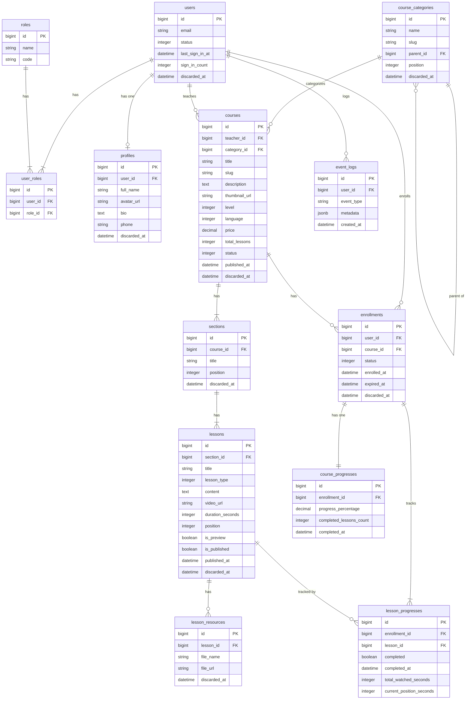

---
tags:
  - elearning
  - erd
  - diagram
  - phase-1
---

# ERD Diagram — Phase 1

> 📎 [[20-Projects/elearning/erd|ERD Text]] · [[20-Projects/elearning/story|Story]] · [[20-Projects/elearning/erd-diagram-phase2|Phase 2 →]]

