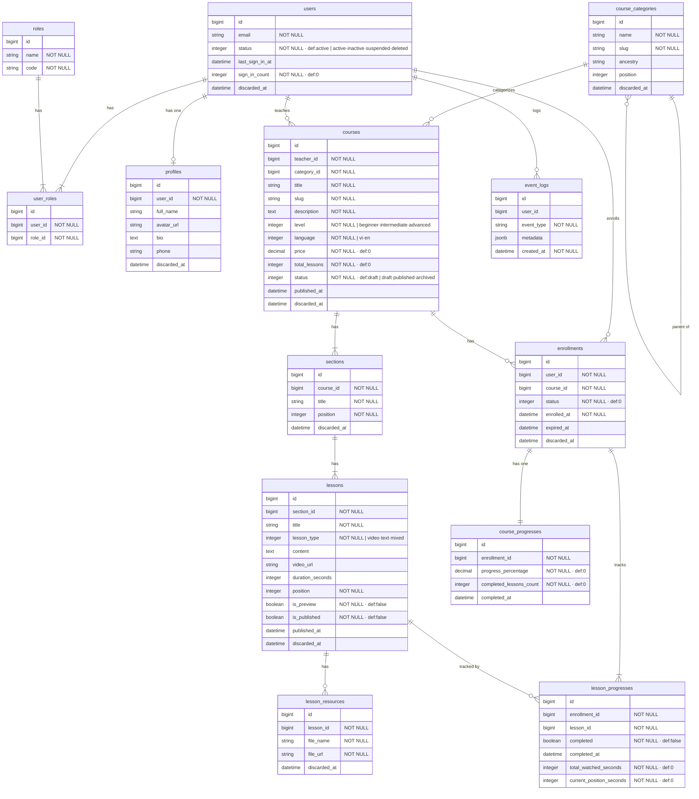

---
tags:
  - elearning
  - erd
  - diagram
  - phase-1
---

# ERD Diagram — Phase 1

> 📎 [[erd|ERD Text]] · [[20-Projects/personal/elearning/story|Story]] · [[20-Projects/elearning/erd-diagram-phase2|Phase 2 →]]

```mermaid
erDiagram
    users {
        bigint id
        string email "NOT NULL"
        integer status "NOT NULL · def:active | active·inactive·suspended·deleted"
        datetime last_sign_in_at
        integer sign_in_count "NOT NULL · def:0"
        datetime discarded_at
    }

    roles {
        bigint id
        string name "NOT NULL"
        string code "NOT NULL"
    }

    user_roles {
        bigint id
        bigint user_id "NOT NULL"
        bigint role_id "NOT NULL"
    }

    profiles {
        bigint id
        bigint user_id "NOT NULL"
        string full_name
        string avatar_url
        text bio
        string phone
        datetime discarded_at
    }

    course_categories {
        bigint id
        string name "NOT NULL"
        string slug "NOT NULL"
        string ancestry
        integer position
        datetime discarded_at
    }

    courses {
        bigint id
        bigint teacher_id "NOT NULL"
        bigint category_id "NOT NULL"
        string title "NOT NULL"
        string slug "NOT NULL"
        text description "NOT NULL"
        integer level "NOT NULL | beginner·intermediate·advanced"
        integer language "NOT NULL | vi·en"
        decimal price "NOT NULL · def:0"
        integer total_lessons "NOT NULL · def:0"
        integer status "NOT NULL · def:draft | draft·published·archived"
        datetime published_at
        datetime discarded_at
    }

    sections {
        bigint id
        bigint course_id "NOT NULL"
        string title "NOT NULL"
        integer position "NOT NULL"
        datetime discarded_at
    }

    lessons {
        bigint id
        bigint section_id "NOT NULL"
        string title "NOT NULL"
        integer lesson_type "NOT NULL | video·text·mixed"
        text content
        string video_url
        integer duration_seconds
        integer position "NOT NULL"
        boolean is_preview "NOT NULL · def:false"
        boolean is_published "NOT NULL · def:false"
        datetime published_at
        datetime discarded_at
    }

    lesson_resources {
        bigint id
        bigint lesson_id "NOT NULL"
        string file_name "NOT NULL"
        string file_url "NOT NULL"
        datetime discarded_at
    }

    enrollments {
        bigint id
        bigint user_id "NOT NULL"
        bigint course_id "NOT NULL"
        integer status "NOT NULL · def:0"
        datetime enrolled_at "NOT NULL"
        datetime expired_at
        datetime discarded_at
    }

    lesson_progresses {
        bigint id
        bigint enrollment_id "NOT NULL"
        bigint lesson_id "NOT NULL"
        boolean completed "NOT NULL · def:false"
        datetime completed_at
        integer total_watched_seconds "NOT NULL · def:0"
        integer current_position_seconds "NOT NULL · def:0"
    }

    course_progresses {
        bigint id
        bigint enrollment_id "NOT NULL"
        decimal progress_percentage "NOT NULL · def:0"
        integer completed_lessons_count "NOT NULL · def:0"
        datetime completed_at
    }

    event_logs {
        bigint id
        bigint user_id
        string event_type "NOT NULL"
        jsonb metadata
        datetime created_at "NOT NULL"
    }

    users ||--|{ user_roles : "has"
    roles ||--|{ user_roles : "has"
    users ||--o| profiles : "has one"
    course_categories ||--o{ course_categories : "parent of"
    course_categories ||--o{ courses : "categorizes"
    users ||--o{ courses : "teaches"
    courses ||--|{ sections : "has"
    sections ||--|{ lessons : "has"
    lessons ||--o{ lesson_resources : "has"
    users ||--o{ enrollments : "enrolls"
    courses ||--o{ enrollments : "has"
    enrollments ||--|{ lesson_progresses : "tracks"
    lessons ||--o{ lesson_progresses : "tracked by"
    enrollments ||--|| course_progresses : "has one"
    users ||--o{ event_logs : "logs"
```
